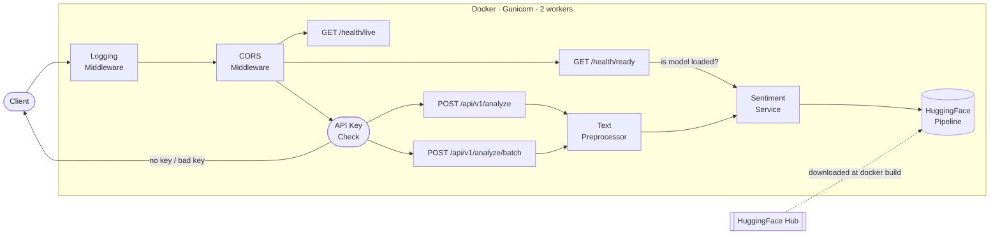
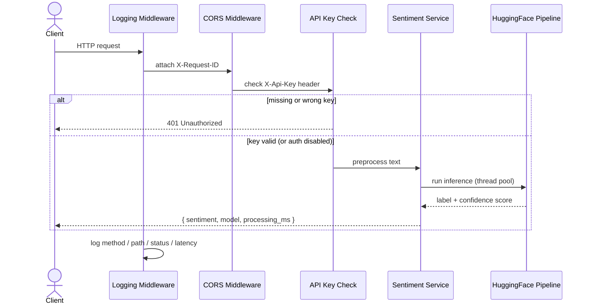

# System Design

## Architecture

```mermaid
graph LR
    Client(["Client"])

    subgraph Docker["Docker  ·  Gunicorn  ·  2 workers"]
        Log["Logging\nMiddleware"]
        CORS["CORS\nMiddleware"]

        Live["GET /health/live"]
        Ready["GET /health/ready"]

        Auth(["API Key\nCheck"])

        Analyze["POST /api/v1/analyze"]
        Batch["POST /api/v1/analyze/batch"]

        Preprocess["Text\nPreprocessor"]
        Service["Sentiment\nService"]
        Model[("HuggingFace\nPipeline")]
    end

    HF[["HuggingFace Hub"]]

    Client --> Log --> CORS
    CORS --> Live & Ready
    CORS --> Auth
    Auth -->|"no key / bad key"| Client
    Auth --> Analyze & Batch
    Ready -->|"is model loaded?"| Service
    Analyze & Batch --> Preprocess --> Service --> Model
    HF -.->|"downloaded at docker build"| Model
```

---

## Request Flow

```mermaid
sequenceDiagram
    actor Client
    participant Log as Logging Middleware
    participant CORS as CORS Middleware
    participant Auth as API Key Check
    participant Svc as Sentiment Service
    participant Model as HuggingFace Pipeline

    Client->>Log: HTTP request
    Log->>CORS: attach X-Request-ID
    CORS->>Auth: check X-Api-Key header

    alt missing or wrong key
        Auth-->>Client: 401 Unauthorized
    else key valid (or auth disabled)
        Auth->>Svc: preprocess text
        Svc->>Model: run inference (thread pool)
        Model-->>Svc: label + confidence score
        Svc-->>Client: { sentiment, model, processing_ms }
    end

    Log->>Log: log method / path / status / latency
```
